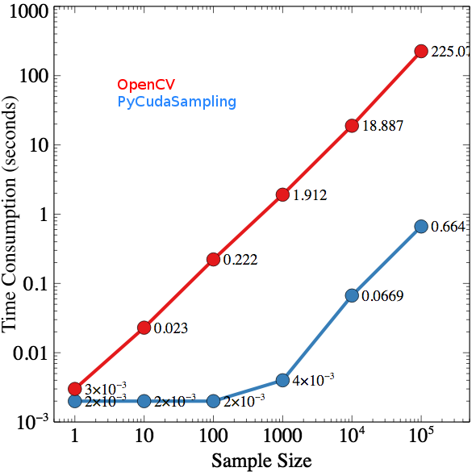

# PyCudaSampling: A Python Package for Image Sampling based on CUDA

This package is a python 2/3 package providing GPU-accelerated image sampling.

Perhaps image sampling isn’t the most important step in most of image processing projects, it is definitely a necessary one. However, image sampling in sometimes can be painful. In some cases, whole input images are too huge to be loaded into memory, in order to fetch the image features, cropping image patches over the whole input image is the approach frequently being considered.

On the other hand, in recent, deep learning (DL) has received much attention from both academia and industry, and it usually requires a huge size of training set. To fulfill the needs of the designed deep neural networks, data augmentation has been frequently discussed, in which, image sampling remains an important step.

Essentially, image sampling is nothing but reading/writing data into memory. However, the strategies of selecting the regions of interests can be a bottleneck which slows down the process of image sampling. Thus, we proposed the github project offering an API for cropping image patches over the whole input image using a massive parallelized fashion. As a result, image sampling can be efficient so that the whole machine learning process can be accelerated.

## Performance 

We have comparied the performance in between OpenCV and PyCudaSampling. We setup an experiement (please see the tests folder) which aimed to repeatly sample a region from lena, and we measured the time consumptions of the two methods. Note that when sampling 10000 of 16x16 images from the input, OpenCV costed 225 seconds while PyCudaSampling spent only 0.664 seconds.

## Installation

pip install git+https://github.com/huangch/PyCudaSampling.git@master

This package has been tested in both python 2.7 and 3.6.
Happy coding!

